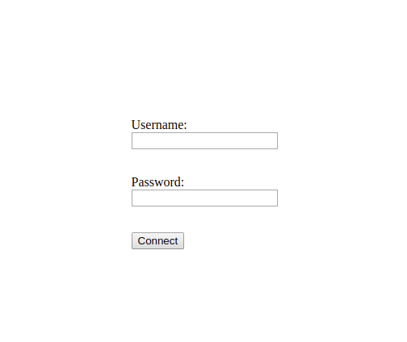
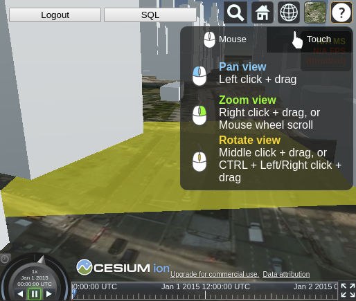
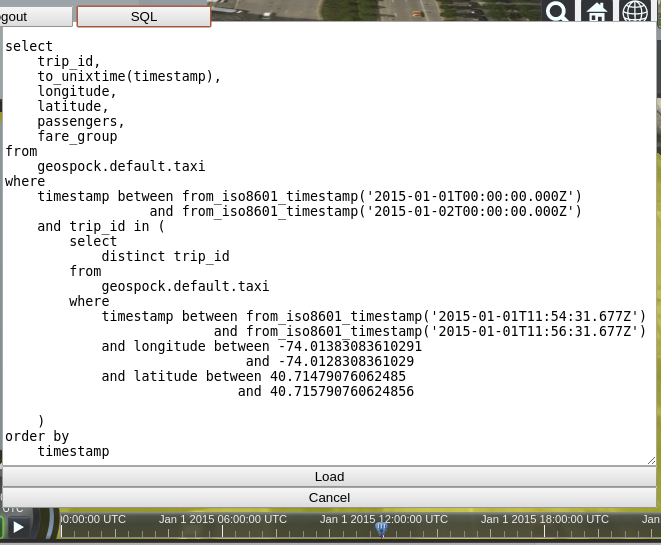
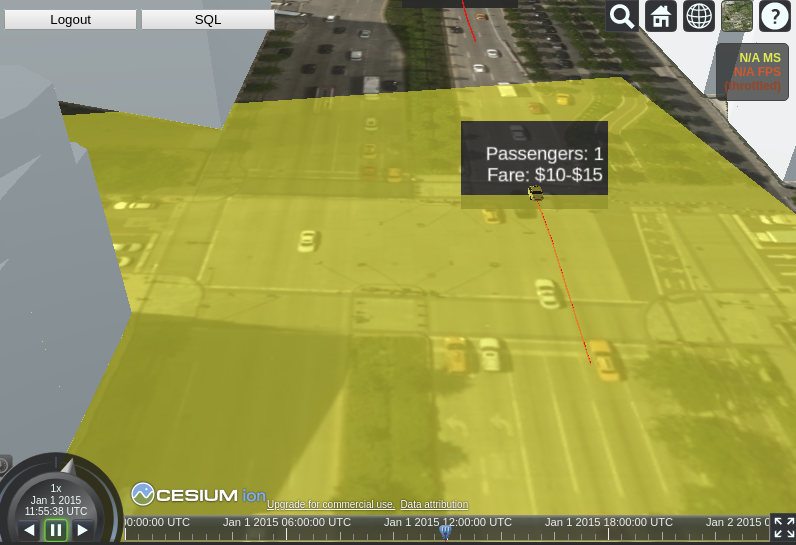

# CesiumJS 3D World Simulation Example

This example project provides all the code and data for a self-contained web app that uses [**CesiumJS**](https://cesium.com/cesiumjs/) to create a 3D city simulation in the browser, populated with animated vehicles playing back tracking data queried from [**GeoSpock DB**](https://geospock.com). Use as the starting point for your own GeoSpock-powered 3D world simulations.

## Preparing the dataset in GeoSpock DB

You need access to a deployment of **GeoSpock DB 3.0**, into which you must ingest the _Synthesized Taxi Tracking in New York City_ example dataset, using the dataset ID `synthesisedtaxidatanyc`. Full instructions can be found in the [README from the datasets folder](../datasets/) in this repository.

## Prerequisites for running the example

Clone this repository so you have the whole project available locally to build and run.

Copy the file `src/config-template.js` to `src/config.js`, edit this file to include:

 * **prestoURL** - the _SQL access_ URI for your **GeoSpock DB** deployment
 * **cesiumIonToken** - your Cesium ion API access token
 * **taxiAsset** - the Cesium ion asset name for the 3D vehicle model
 * **cityAsset** - the Cesium ion asset name for the 3D city environment tileset

### Cesium ion API access token

If you don't already have a [Cesium ion API access token](https://cesium.com/docs/tutorials/rest-api/), you’ll need to [sign up](https://cesium.com/ion/ion/signup) for a free Cesium ion community account.

### 3D vehicles

3D vehicle models are included in the source code at `src/models/cars/Realistic Car Pack - Nov 2018/OBJ/Taxi.*` these must be uploaded to your Cesium ion account. The models were obtained from https://quaternius.itch.io/lowpoly-cars

### 3D city

The 3D city environment for the simulation, which must also be uploaded to Cesium ion, is provided by GeoSpock in a public [“requester pays” AWS S3 bucket](https://docs.aws.amazon.com/AmazonS3/latest/dev/RequesterPaysBuckets.html) named `geospock-example-data`. To download the file, run the following AWS CLI command:

```
$ aws s3 cp s3://geospock-example-data/LowerManhattan.gml . --request-payer
```

Once you have the file, upload it to your Cesium ion account. To ensure the building models are correctly positioned, select the **“clamp to sea level”** option when uploading.

## Building and running the application

You can use either [NPM](https://www.npmjs.com/) or [Yarn](https://yarnpkg.com/) to install the required third party libraries:

```
$ [npm | yarn] install
```

You can then start the example application by executing the `start` script:

```
$ [npm | yarn] start
```

This will start Webpack running on [http://localhost:3130](http://localhost:3130).

## Using the application

Enter the username for a GeoSpock DB user that has been granted access permissions to the `synthesisedtaxidatanyc` dataset that you ingested above, and the password for that user.



Select an area (navigation help shown, yellow rectangle is the selected area), and a time using the timeline at the bottom:



Press the **SQL** button to view a query for taxis that passed through the selected area at the selected time. You can modify the SQL if you want to perform further filtering. Press the **Load** button to run the query and start the simulation with the results:



After waiting for data to load (time depending on size of dataset), you should see the simulated vehicles moving along their tracks. Control the simulation using the spatial and time controls, and view metadata for individual vehicles by clicking on a taxi:


