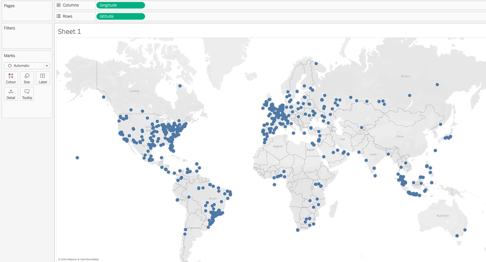
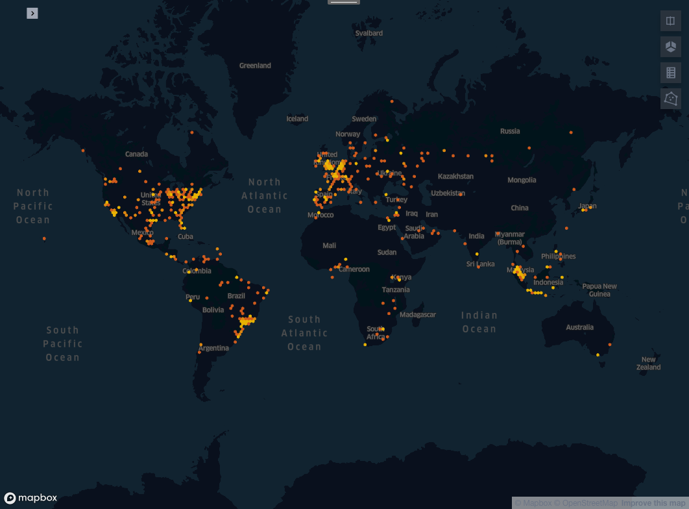

#Case Study
This case study shows you how to analyze one million music tweets, using a Kepler visualisation within Tableau integrated with the GeoSpock database. The case study covers how to:
- ingest your data into the GeoSpock database
- connect Tableau to the GeoSpock database
- create a Kepler visualisation within Tableau
- run a number of queries on this data including visualizing the tweets based on their location, as well as artist popularity.

## Ingesting data into the Geospock database
Download the data for this case study [here](http://www.cp.jku.at/datasets/MMTD/tweet.zip).

Copy the CSV file provided into an S3 bucket. To ingest this data, use the schema defined below and the following GeoSpock CLI command to ingest the data into the GeoSpock database:

```geospock dataset-create --dataset-id tweets3 --data-url <path to the csv file in the s3 bucket> --schema-file <schema file containing the below} --cluster-size XSMALL```"

```
{
    'format': 'COLUMNAR',
    'columnarFormatSeparator': '\t',
    'properties': [
        {'id': 'tweet_id', 'type': 'TEXT', 'sourceFieldIndex': 0},
        {'id': 'tweet_tweetid', 'type': 'TEXT', 'sourceFieldIndex': 1},
        {'id': 'tweet_userid', 'type': 'TEXT', 'sourceFieldIndex': 2},
        {'id': 'tweet_artistid', 'type': 'TEXT', 'sourceFieldIndex': 3},
        {'id': 'tweet_trackid', 'type': 'NUMBER', 'sourceFieldIndex': 4},
        {
            'id': 'timestamp',
            'type': 'TIMESTAMP',
            'sourceFieldIndex': 5,
            'sourceFieldFormat': 'TIMESTAMP_CUSTOM',
            'sourceFieldCustomTimestampFormat': 'yyyy-MM-dd HH:mm:ss'
        },
        {'id': 'tweet_weekday', 'type': 'NUMBER', 'sourceFieldIndex': 6},
        {'id': 'longitude', 'type': 'LONGITUDE', 'sourceFieldIndex': 7},
        {'id': 'latitude', 'type': 'LATITUDE', 'sourceFieldIndex': 8}
    ],
    'indexes': [],
    'zoomLevel': 6
}
```

## Visualizing your queries using Kepler
To begin, connect Tableau to your Presto cluster as detailed [here](https://docs-internal.website.eng.geospock.com/Content/tools/usingTableau.htm), then set up the base query we will be using for this Case Study as a data source. In this case, we'll visualize the tweets from the second of november, for which we can use the following query:

```SELECT event.* FROM geospock.default.tweets3 AS event WHERE event."timestamp" BETWEEN TIMESTAMP '2012-11-02 00:00:00' AND TIMESTAMP '2012-11-02 23:59:59'``` 

The first query in this case study enables you to visualize from where where the tweets on a single day were sent. Go to the first worksheet- you should see all of the columns from the tweets dataset displayed in the dimensions and measures tab on the left hand side of the tableau interface. Latitude and longitude are incorrectly categorised as measures- drag them into the dimensions area to reclassify them as dimensions, so we can use them to visualize from where a tweet was sent.


Dragging these dimensions onto the data sheet automatically switches the display format to a symbol map, which looks like this.


In order to visualize this same map in Kepler, create a new dashboard and drop the new Sheet into it. Then, drag the extension object from the objects bar into the dashboard alongside it.


Select the kepler.gl extension from My Extensions- first downloading it from the Extension Gallery if you haven't already- and a Kepler.gl within Tableau extension object should be added to your dashboard, though it needs some configuration.


To configure the kepler extension to display your data, connect it to the Sheet you created and add your Mapbox key (if you have one). **Note that points will not appear yet- the Kepler points mode is incompatible.** Convert the layer into Hexbin mode, setting the hexagon radius to 100km, so that the data points can be displayed, as follows:



## Looking at Paris
For the next query, we will focus on tweets originating from the city of Paris. Create a new data source and create a new query reading as follows:

```SELECT event.* FROM geospock.default.tweets3 AS event WHERE st_within(st_point(event.longitude, event.latitude), st_geometryfromtext('POLYGON ((2.225 48.854, 2.250 48.881, 2.320 48.901, 2.396 48.900, 2.410 48.881, 2.412 48.8333, 2.356 48.815, 2.225 48.854))'))```

Create a new sheet and add the Kepler extension to visualize the points as described in the previous section. In addition to ‘longitude’ and ‘latitude’, drag tweet_artistid from dimension to ‘Colour’:


So you can add this feature to the dashboard, right click on tweet_artistid and select "Show Filter". Add the sheet to your dashboard as before, but use the default hextile size. 


Note that you can use the filter in the top right here to filter the data coming into Kepler.

## Comparing tweets in Paris against the rest of the world

The next query will investigate whether the artist is popular in the rest of the world as well as in Paris.

Create a data source with the following query: 

```SELECT event.* FROM geospock.default.tweets3 AS event WHERE tweet_artistid = '356772' AND event.timestamp BETWEEN TIMESTAMP '2012-11-01 00:00:00' AND TIMESTAMP '2012-12-01 00:00:00'```

When we use the same process to turn this into a map, we get the following- it looks like the artist is more popular in europe than outside europe, but it's difficult to tell at default size. However, Kepler provides us a tool to examine this more closely. Change the display mode to hexbin and increase the hexbin size to 1000 kilometres- this will reveal the artist in question is indeed disproportionately popular in western continental europe.