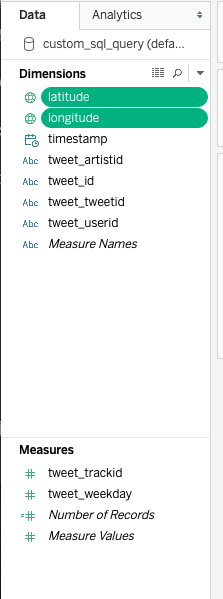
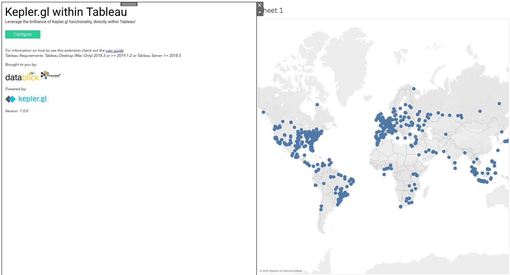
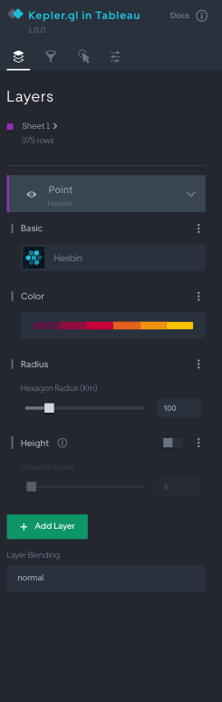
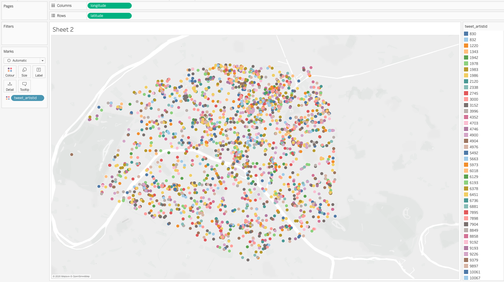
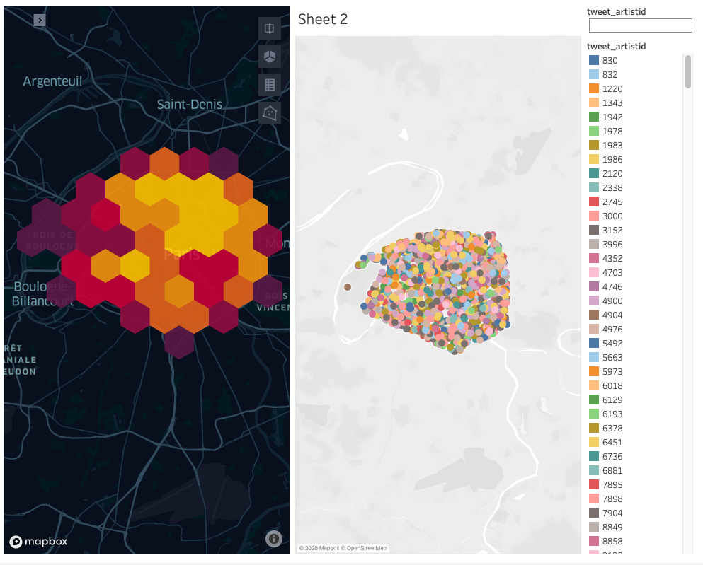

# Tableau Example (with Kepler.gl Visualizations)

This is a tutorial showing how to run GeoSpock DB queries on a (provided) example dataset using [Tableau](https://www.tableau.com), and visualize the results inside Tableau using the [Kepler.gl extension](https://github.com/keplergl/kepler.gl-tableau).

## Preparing the dataset in GeoSpock DB

You need access to a deployment of **GeoSpock DB 3.0**, into which you must ingest the _Million Musical Tweets Dataset_, using the dataset ID `tweet`. Full instructions can be found in the [README from the datasets folder](../datasets/) in this repository.

The [Million Musical Tweets Dataset (MMTD)](http://www.cp.jku.at/datasets/MMTD/) provides a list of events describing when and where people have listened to specific music tracks (`tweet.zip`), extracted from the global Twitter feed between September 2011 and April 2013, and made publicly available by The Johannes Kepler University Linz. The dataset was created as part of [this research paper from 2013](http://www.cp.jku.at/people/hauger/pdf/ISMIR_2013.pdf):

> **The Million Musical Tweets Dataset - What We Can Learn From Microblogs**<br />
> Hauger, D. and Schedl, M. and Košir, A. and Tkalčič, M.<br />
> Proceedings of the 14th International Society for Music Information Retrieval Conference (ISMIR 2013), Curitiba, Brazil, November 2013.


## Connecting Tableau to GeoSpock DB

To connect to **GeoSpock DB**, use Tableau’s Presto driver, which you might need to install. Refer to [this Tableau documentation](https://help.tableau.com/current/pro/desktop/en-us/examples_presto.htm) for more details. Start Tableau and under **“Connect”** select **“Presto”**. Fill in the following connection information:

| Parameter      | Value                             |
| -------------- | --------------------------------- |
| Server         | Your GeoSpock DB deployment’s SQL access hostsname –`sqlaccess.geospock.example.com` |
| Port           | `8446`                            |
| Catalog        | `geospock`                        |
| Schema         | Leave this field blank            |
| Authentication | LDAP                              |
| Username       | Your GeoSpock DB account username |
| Password       | Your GeoSpock DB account password |
| Require SSL    | Enabled                           |

At this point you should install the [**Kepler.gl extension**](https://github.com/keplergl/kepler.gl-tableau) in Tableau from the **Extension Gallery**, if you haven’t already done so. Refer to the [instructions on the `kepler.gl-tableau` GitHub page](https://github.com/keplergl/kepler.gl-tableau) for more details.

## Running a SQL query

Set up the base query we will be using for this case study as a data source. In this case, we’ll visualize the tweets from the second of November, for which we can use the following query:

```sql
SELECT event.*
  FROM geospock.default.tweet AS event
 WHERE event."timestamp" BETWEEN TIMESTAMP '2012-11-02 00:00:00' AND TIMESTAMP '2012-11-02 23:59:59'
```

The first query in this case study enables you to visualize from where where the tweets on a single day were sent. Go to the first worksheet – you should see all of the columns from the tweets dataset displayed in the **Data** tab on the left hand side of the Tableau interface. The `latitude` and `longitude` fields are incorrectly categorized as measures. Drag them into the **Dimensions** area to reclassify them as dimensions, so we can use them to visualize from where a tweet was sent.



Dragging these dimensions onto the data sheet automatically switches the display format to a symbol map, which looks like this:


## Visualizing query results in a Kepler.gl map

In order to visualize this same map in Kepler, create a new dashboard and drop the new sheet into it. Drag the **Extension** object from the **Objects** bar into the dashboard alongside it:


Select the Kepler.gl extension from **My Extensions**, first downloading it from the extension gallery if you haven’t already, and a **“Kepler.gl within Tableau”** extension object should be added to your dashboard:



To configure the Kepler extension to display your data, connect it to the sheet you created and add your MapBox API key (if you have one). Note that data will not appear on the map yet – the Kepler points mode is incompatible. Convert the layer into **Hexbin** mode, setting the hexagon radius to 100 km, so that the data points can be displayed, as follows:




## Looking at Paris

For the next query, we will focus on tweets originating from the city of Paris. Create a new data source and create a new query as follows:

```sql
SELECT event.*
  FROM geospock.default.tweet AS event
 WHERE st_within(st_point(event.longitude, event.latitude), st_geometryfromtext('POLYGON ((2.225 48.854, 2.250 48.881, 2.320 48.901, 2.396 48.900, 2.410 48.881, 2.412 48.8333, 2.356 48.815, 2.225 48.854))'))
```

Create a new sheet and add the Kepler extension to visualize the points as described in the previous section. Set up the `longitude` and `latitude` fields, and set the point coloring to use the `tweet_artistid` field by dragging it from **Dimensions** to the **Marks** box like this:



So you can add this feature to the dashboard, right click on `tweet_artistid` and select **Show Filter**. Add the sheet to your dashboard as before, but use the default hextile size.



Note that you can use the filter in the top right here to filter the data coming into Kepler.

## Comparing Paris tweets to the rest of the world

The next query will investigate whether the artist is popular in the rest of the world as well as in Paris.

Create a data source with the following query:

```sql
SELECT event.*
  FROM geospock.default.tweet AS event
 WHERE tweet_artistid = '356772' AND event.timestamp BETWEEN TIMESTAMP '2012-11-01 00:00:00' AND TIMESTAMP '2012-12-01 00:00:00'
```

Use the same steps as above to visualize the new results. It looks like the artist is more popular in Europe than outside Europe, but it’s difficult to tell at the default size. Kepler provides us a tool to examine this more closely. Change the display mode to **Hexbin** and increase the hexbin size to 1000 km. This will reveal the artist in question is indeed disproportionately popular in western continental Europe.
